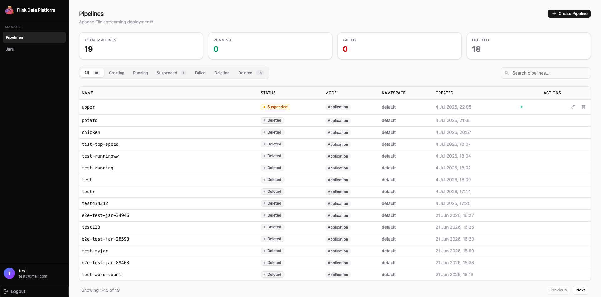

# Flink Data Platform

A management UI for Apache Flink deployments on Kubernetes: create, monitor, and control Flink jobs running via the [Flink Kubernetes Operator](https://nightlies.apache.org/flink/flink-kubernetes-operator-docs-stable/). Built as the TIC4902 capstone project


## Dashboard


## Features

- **Pipeline creation**: configure and launch Flink jobs (image, parallelism, JobManager/TaskManager resources) through the UI, backed by the Flink Kubernetes Operator CRD
- **Pipeline updates & deletion**: edit an existing deployment's config or remove it entirely
- **JAR management**: upload, list, and delete job JARs in object storage, and reference them directly when creating a deployment
- **Stop / start / force-stop**: graceful stop takes a savepoint before tearing the job down and force-stop skips it for a stateless teardown
- **Savepoint management**: trigger a savepoint on demand and list all savepoints recorded for a deployment
- **Resume from savepoint**: restart a deployment from its last savepoint, a specific savepoint you pick, or skip state restore entirely
- **Live status sync**: deployment status merges the database record with live Kubernetes status, so it stays accurate even if the DB and cluster drift
- **Auth & accounts**: JWT-based register/login, plus profile view/update, password change, and account deletion

## Tech Stack

| Layer | Stack |
|-------|-------|
| Frontend | React 19, Vite, TypeScript, Tailwind CSS v4, shadcn/ui, react-router-dom, axios |
| Backend | Node.js, Express, Sequelize (PostgreSQL), `@kubernetes/client-node`, JWT auth |
| Data & Infra | PostgreSQL, Kafka (3-broker), MinIO (object storage), Flink Kubernetes Operator on Minikube |

## Quick Start

```bash
# 1. Start shared infra such as PostgreSQL, Kafka, Kafka UI, MinIO
docker compose up -d

# 2. Set up Flink Kubernetes Operator 
./local-script/setup-flink-operator.sh

# 3. Backend
cd backend
cp .env.example .env   # fill in DB, JWT, MinIO settings
npm install
npm run dev             # http://localhost:3000, Swagger at /api-docs

# 4. Frontend
cd frontend
npm install
npm run dev              # http://localhost:5173
```

**Useful URLs once running:**

| Service | URL |
|---------|-----|
| Frontend | http://localhost:5173 |
| Backend API docs (Swagger) | http://localhost:3000/api-docs |
| Kafka UI | http://localhost:8080 |
| MinIO Console | http://localhost:9001 (`minioadmin` / `minioadmin`) |

## Project Structure

```
backend/        Express API, Sequelize models, Kubernetes + MinIO services
frontend/       React app (Vite, shadcn/ui)
k8s/             Raw Kubernetes manifests (JobManager/TaskManager/MinIO)
local-script/    Setup, build, deploy, and test scripts for Minikube + Flink
docs/            Reference guides (API, Kubernetes deployment, debugging)
```

## Documentation

- [API Reference](docs/api-reference.md) — deployment & JAR management endpoints, curl examples
- [Kubernetes Deployment Guide](docs/kubernetes-deployment.md) — Minikube setup, deploying Flink, accessing dashboards
- [Debugging Guide](docs/debugging.md) — common errors and fixes
- [Testing Savepoints](docs/testing-savepoints.md) — verifying stop/resume state recovery

## License

[MIT](LICENSE)
